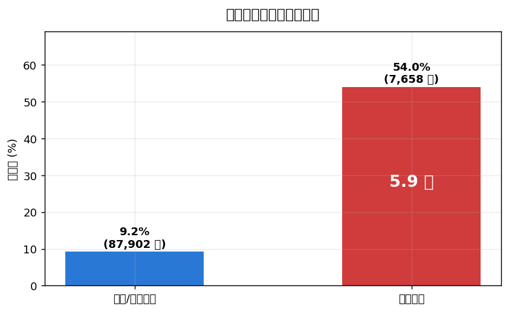
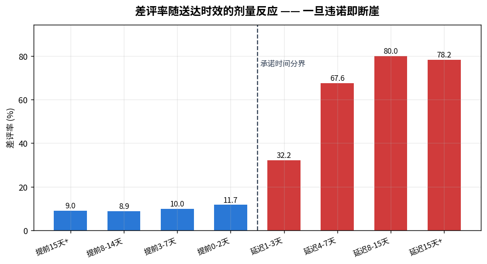
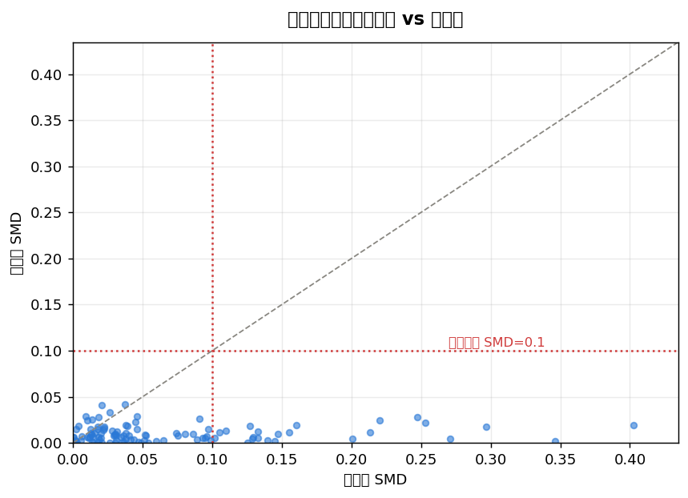
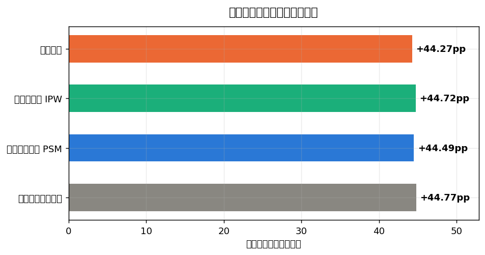
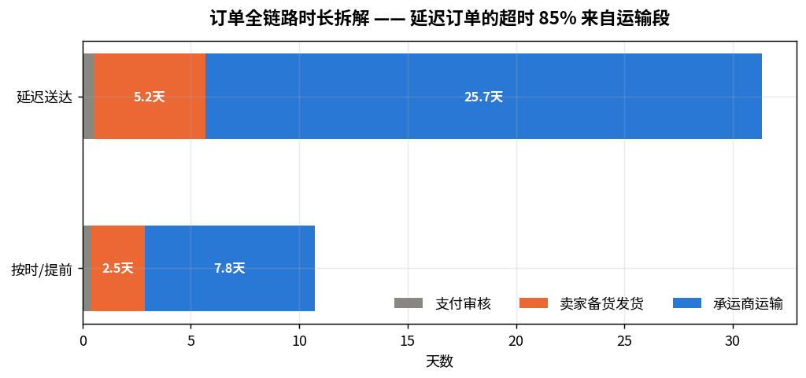
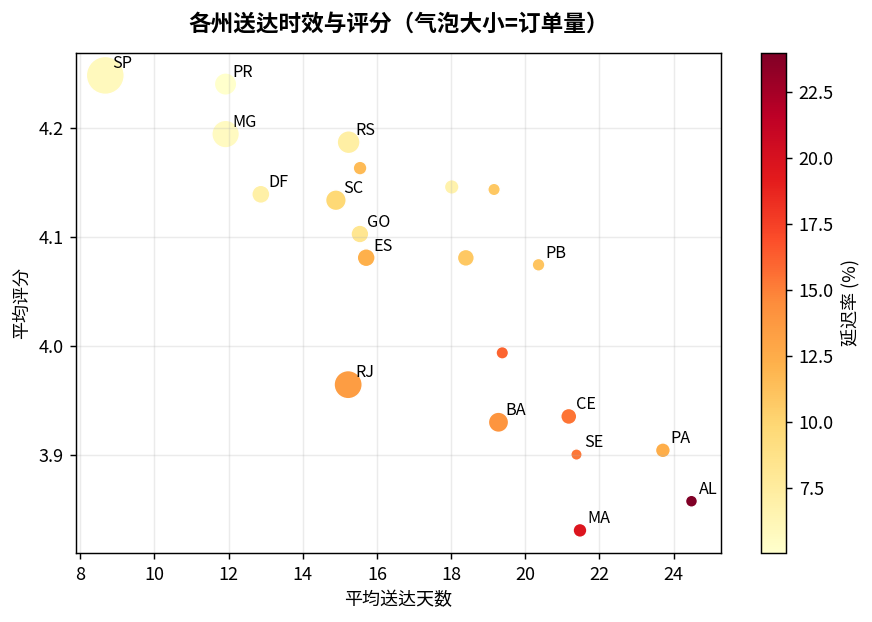
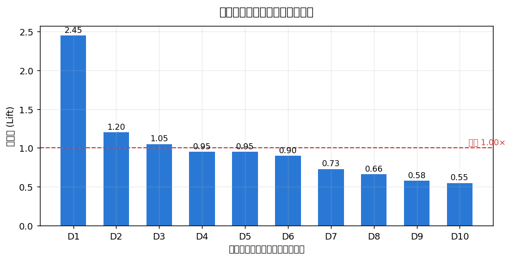

# Olist 电商平台履约质量与客户体验分析

> 基于巴西电商平台 Olist 的**真实公开数据集**（9 张表、9.8 万订单、11.2 万订单明细、10 万条真实评论）。
> 从一个业务问题出发：**平台差评率 13.7%，钱花在哪能最有效地把它降下来？**

**数据来源**：[olist/work-at-olist-data](https://github.com/olist/work-at-olist-data)（Olist 官方公开数据集）
**分析窗口**：2017-01 ~ 2018-08
**技术栈**：DuckDB / SQL（窗口函数、CTE）· Python（Pandas、scikit-learn、LightGBM、SciPy）

---

## 核心结论

| # | 结论 | 支撑数据 |
|---|---|---|
| 1 | 延迟送达是差评的**主导成因**，且伤害是断崖式的 | 延迟订单差评率 **54.0%** vs 按时 **9.2%**；仅延迟 1-3 天，差评率就从 11.7% 跳到 32.2% |
| 2 | 这个效应经因果推断验证为**真实且几乎无混杂偏差** | PSM 估计 ATT **+45.05pp**（95% CI [43.73, 46.36]）；110 个协变量匹配后 SMD 全部 < 0.045 |
| 3 | 延迟的责任 **85.5% 在运输段**，不在卖家 | 延迟订单的超时中，运输段超出 18.67 天，卖家备货段仅超出 3.18 天 |
| 4 | 卖家规模与延迟率**无关**，治理卖家不是正确抓手 | 头部 7.78% / 腰部 7.31% / 长尾 7.70% / 零星 8.09%，四档几乎持平 |
| 5 | 平台在用**拉长承诺时间**掩盖履约能力不足，代价是评分 | 承诺 30 天以上的订单延迟率最低（5.6%）但评分也最低（4.075）；承诺 10 天内延迟率最高（17.3%）评分却最高（4.338） |
| 6 | 真实复购率只有 **2.17%**，平台几乎完全靠拉新 | 老客 GMV 占比常年 2~3%；且这个 2.17% 是修正两次口径陷阱后的数字 |

---

## 数据质量：三个真实数据才有的坑

真实数据最大的价值不在"更真实"，而在于它会**主动骗你**。本项目在写任何分析前先做了数据质量探查，抓到三个会直接导致结论错误的陷阱。

### 坑一：`customer_id` 不是客户

Olist 的 `customer_id` 是**订单级**的一次性键——99,441 个订单对应 99,441 个 `customer_id`。真正的自然人标识是 `customer_unique_id`（96,096 个）。

```
用 customer_id 算复购率        →  0.000%   ← 荒唐但不报错
用 customer_unique_id 算       →  3.035%
```

**这是最危险的一类 bug：它不会抛异常，只会静默地给出一个错误答案。**

### 坑二：同日"复购"其实是购物车拆单

修好口径后，复购间隔的 P25 是 **0 天**——大量"复购"发生在同一天。Olist 是多卖家平台，一个购物车里的商品来自不同卖家时会被拆成多个 `order_id`。

验证：同日复购对中，**63.1% 指向不同卖家**，869 对间隔在 30 分钟以内。

```
表面复购率（customer_unique_id）  →  3.035%
剔除同日拆单后的真实复购率        →  2.168%   ← 降了 29%
```

### 坑三：多表 JOIN 让 GMV 虚高 4.57%

`orders`、`order_items`、`order_payments`、`order_reviews` 全是一对多（每单最多 21 条明细、29 条支付记录、3 条评论）。

```
先聚合再 JOIN（正确）                  →  1,584.8 万
orders × items × payments 直接 JOIN    →  1,657.2 万   （+4.57%）
再 JOIN 上 reviews                     →  1,649.6 万
```

因此 `sql/00_create_views.sql` 把所有金额字段先在子查询里聚合到订单粒度，再向外 JOIN——这是整个项目的口径地基。

---

## 分析主线

### 一、现象：延迟送达与差评的关系



延迟订单的差评率是按时订单的 **5.9 倍**。但真正有价值的不是这个倍数，而是下面这张剂量反应图：



**关键发现：伤害不是渐进的，是断崖式的。**

| 时效区间 | 差评率 | 环比变化 |
|---|---|---|
| 提前 3-7 天 | 10.0% | — |
| 提前 0-2 天 | 11.7% | +1.8pp |
| **延迟 1-3 天** | **32.2%** | **+20.5pp** |
| 延迟 4-7 天 | 67.6% | +35.4pp |
| 延迟 8-15 天 | 80.0% | +12.4pp |

提前 15 天和提前 3 天，差评率几乎没有区别（9.0% vs 10.0%）——**客户不奖励"快"**。
但只要越过承诺时间一天，差评率立刻翻三倍——**客户严厉惩罚"违诺"**。

这条结论直接决定了运营重点：**与其压缩平均时效，不如提高时效的确定性。**

---

### 二、因果推断：这个效应是真的吗？

上面的 44.9pp 差距不能直接汇报，因为**会延迟的订单本来就不是随机的一批**。它们更可能是跨州的、大件重货的、来自履约能力差的卖家的——而这些特征本身就会拉低评分。

所以用**倾向得分匹配（PSM）**估计 ATT：

| 步骤 | 做法 | 结果 |
|---|---|---|
| 协变量 | 金额、件数、重量体积、承诺时长、支付方式、品类、客户州、卖家州、跨州、下单月份、卖家历史延迟率 | 110 维 |
| 倾向得分 | 逻辑回归 | AUC 0.781（适合匹配的区间） |
| 共同支撑域 | 剔除无可比对象的样本 | 保留 99.89% |
| 匹配 | 1:1 最近邻 + 0.2×logit(PS) 标准差卡尺 | 成功匹配 99.99% |
| 平衡性 | 标准化均值差 SMD | 匹配前 24 个协变量 > 0.1（最大 0.399）→ **匹配后全部 < 0.045** |



**估计结果：**



| 方法 | ATT（差评率提升） |
|---|---|
| 朴素对比 | +44.92 pp |
| **倾向得分匹配 PSM** | **+45.05 pp** |
| 逆概率加权 IPW | +44.85 pp |
| 回归调整 | +44.38 pp |

四种方法极差仅 0.67pp，结论不依赖任何单一方法。

> **一个与预期相反的结果，值得单独说明。**
>
> 事前假设是"朴素对比会高估延迟的伤害"，但匹配后发现**选择偏差只有 0.13pp（0.3%）**——朴素估计本来就近乎无偏。
>
> 匹配前确实有 24 个协变量不平衡，两组订单的构成差异是真实的；但这些差异对差评率的影响，相比"延迟"本身小到可以忽略。
>
> 这本身就是一个业务结论：**延迟对客户情绪的伤害，几乎不取决于这单有多难送。** 同城小件延迟一天和跨州大件延迟一天，客户的愤怒程度是接近的——他们只对照承诺时间。这条结论直接否定了"偏远地区差评没办法"这种内部说辞。
>
> 同时必须诚实：偏差小是**做完才知道**的，事前无法预判。跳过这一步直接报朴素数字，是运气好，不是方法对。
>
> 边界说明：PSM/IPW/回归调整纠正的都只是**可观测混杂**。若存在未观测混杂（卖家客服响应速度、实物与描述的差距），仍会残留在估计里。这是"在可观测特征上尽可能干净的对比"，不是随机实验级别的证据。

---

### 三、归因：延迟是谁造成的？

把订单全链路拆成三段：下单→审核→卖家交承运商→送达客户。



| | 支付审核 | 卖家备货发货 | 承运商运输 | 总时长 |
|---|---|---|---|---|
| 按时/提前 | 0.42 天 | 2.45 天 | 7.84 天 | 10.80 天 |
| 延迟送达 | 0.51 天 | 5.18 天 | **25.67 天** | 31.46 天 |

以按时订单的中位数为基准，延迟订单的超时中：

- 卖家备货段超出 **3.18 天**（责任占比 **14.5%**）
- 承运商运输段超出 **18.67 天**（责任占比 **85.5%**）
- 只有 **18.8%** 的延迟订单主因在卖家

**交叉验证**：如果延迟主要是卖家问题，那么不同规模的卖家应该表现出差异。实际数据是：

| 卖家分层 | 卖家数 | GMV 占比 | 延迟率 | 平均评分 |
|---|---|---|---|---|
| 头部（500 单+） | 26 | 19.9% | 7.78% | 4.033 |
| 腰部（100-499） | 184 | 32.5% | 7.31% | 4.062 |
| 长尾（20-99） | 603 | 30.5% | 7.70% | 4.103 |
| 零星（<20） | 2,216 | 17.2% | 8.09% | 4.009 |

四档延迟率几乎持平。**卖家规模与履约质量无关——这不是卖家治理问题，是物流网络问题。**

地理证据进一步支持：跨州配送占 64.2%，平均 15.1 天、延迟率 9.27%；同州配送 7.9 天、延迟率 6.10%。卖家高度集中在 SP 州（1,807 家，65% 的 GMV），而东北部各州（AL、MA、CE）送达要 21-25 天，延迟率高达 16-24%。



---

### 四、一个被数据揭穿的"解决方案"

平台当前应对履约能力不足的方式是**拉长承诺时间**。数据显示这是在拆东墙补西墙：

| 承诺时长 | 订单数 | 实际用时 | 富余天数 | 延迟率 | 平均评分 |
|---|---|---|---|---|---|
| 10 天内 | 3,945 | 4.7 天 | 3.2 天 | **17.31%** | **4.338** |
| 11-20 天 | 26,718 | 8.2 天 | 8.2 天 | 7.45% | 4.238 |
| 21-30 天 | 45,932 | 13.5 天 | 11.5 天 | 8.82% | 4.129 |
| 30 天以上 | 19,608 | 17.4 天 | **19.2 天** | **5.59%** | **4.075** |

承诺越长，延迟率越低（违诺风险确实下降了），**但评分单调下降**。承诺 30 天以上的订单平均留了 19.2 天缓冲——客户要等的是这个被拉长的承诺，而不是实际的 17.4 天。

**平台把"准时率"这个 KPI 做漂亮了，代价是客户满意度。** 这是一个典型的指标错配：优化了考核指标，损害了它本该代表的业务目标。

---

### 五、下单时就能预警吗？

如果差评主要由延迟造成，而延迟在下单时还没发生，那能提前识别吗？训练两个模型对比：

| 模型 | 特征 | AUC | KS | 用途 |
|---|---|---|---|---|
| A | 含履约结果（delivery_days、is_late…） | 0.732 | 0.353 | 事后归因 |
| B | **仅下单时可得特征** | 0.636 | 0.192 | 线上预警 |



模型 B 的 AUC 0.636 不高，但它是唯一能上线的那个。按它的分数排序：

- **TOP 10%**（2,111 单）实际差评率 **24.6%**，是基线的 **2.43 倍**，覆盖 24.3% 的差评
- TOP 20% 覆盖率升到 36.2%，命中率降到 18.3%

模型 A 的归因结果（增益占比）：

| 驱动因素 | 解释力 |
|---|---|
| 履约表现（`days_early` 单项占 62%） | **67.6%** |
| 订单与支付 | 16.7% |
| 卖家历史 | 7.2% |
| 商品属性 | 6.3% |
| 地理距离 | 2.3% |

> **一个必须记录的 bug。**
>
> 第一版实现里，模型 B 的 AUC 是 **0.932**，卖家历史特征的解释力高达 60.7%。数字好看得不正常。
>
> 排查后发现是**时间穿越泄漏**：卖家历史差评率虽然做了留一法（剔除当前订单），但统计窗口是整个时间段——对验证集里 2018 年 6 月的订单来说，它的"卖家历史"里混进了 7、8 月才发生的订单。
>
> 改成**扩展窗口**（每单只能看到该卖家在它之前的订单）后：
> - 模型 B 的 AUC：0.932 → **0.636**
> - 卖家历史的解释力：60.7% → **7.2%**
> - 履约表现的解释力：22.9% → **67.6%**
>
> 归因结论完全反转。留一法防住的是"标签泄漏"，防不住"时间泄漏"——这两件事不一样。

---

## 建议

按投入产出排序：

**1. 把考核从"准时率"改成"承诺时长 + 准时率"双指标**
当前靠拉长承诺来保准时率，是在用客户等待时间换 KPI。应当同时约束承诺时长的中位数，堵住这条捷径。

**2. 优先治理运输网络，而非卖家**
85.5% 的超时来自运输段，且卖家规模与延迟率无关。资源应投向东北部各州的干线与末端网络，而不是给卖家发罚单。

**3. 用预警模型做主动干预**
对下单时预警分数 TOP 10% 的订单（差评率 24.6%，2.43 倍基线）做提前催发货、主动告知物流进度。具体触达比例取决于单次干预成本与一条差评的代价。

**4. 收益测算（分档，不画大饼）**

| 情形 | 延迟率目标 | 可消除差评 | 占差评总量 |
|---|---|---|---|
| A | 8.0% → 5.0%（对齐 SP 州现有水平） | ~1,255 条 | 10.5% |
| B | 8.0% → 6.5%（治理最差的线路与卖家） | ~625 条 | 5.2% |

理论上界（延迟率归零）是 3,352 条、占 28.1%，但那是不可达成的，不应写进 OKR。

---

## 项目结构

```
olist-analysis/
├── data/                              # 9 张原始 CSV（脚本自动下载）
├── sql/
│   ├── 00_create_views.sql            口径定义与 DWD 视图层 ★地基
│   ├── 01_business_overview.sql       业务全景、GMV 拆解、品类与地域
│   ├── 02_delivery_quality.sql        履约时效、剂量反应、链路归因 ★核心
│   ├── 03_repurchase_ltv.sql          复购口径陷阱、队列留存、LTV ★核心
│   └── 04_seller_performance.sql      卖家分层、问题卖家定位、治理价值
├── python/
│   ├── 01_data_quality.py             数据质量探查
│   ├── 02_review_driver.py            差评归因与下单时预警模型 ★核心
│   ├── 03_causal_delivery.py          倾向得分匹配因果推断 ★核心
│   ├── 04_visualize.py                图表与结论导出
│   └── run_sql.py                     SQL 执行器
└── output/
    ├── figures/                       9 张分析图表
    └── report_data.json               结构化结论数据
```

## 快速开始

```bash
pip install -r requirements.txt
python python/01_data_quality.py       # 下载数据 + 质量探查
python python/run_sql.py               # 执行全部 SQL 分析
python python/02_review_driver.py      # 差评归因与预警模型
python python/03_causal_delivery.py    # PSM 因果推断
python python/04_visualize.py          # 生成图表
```
